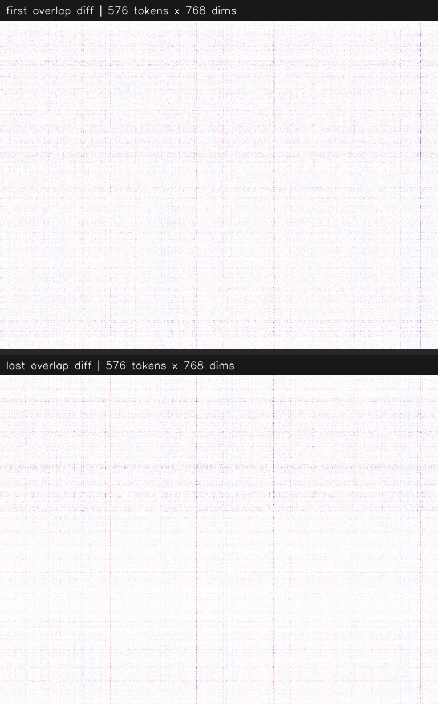

# V-JEPA 2.1 Pipeline

[](latent_comparison.jpg)

This project is a small investigation into how stable V-JEPA 2.1 latent representations are when two sliding windows overlap in time.

The core idea is simple: take two nearby windows from a video, align only the latent time steps that should represent the same overlapping content, and inspect how different those latent spaces are right at the overlap boundary.

## What I am trying to investigate

I wanted to check whether overlapping time slices from adjacent sliding windows produce similar latent representations at the exact points where the windows overlap.

More specifically, for each pair of windows:

- the first window is encoded into a latent tensor
- the second window is encoded into a latent tensor
- the overlapping latent time steps are aligned using the expected latent shift
- matching overlap slices are subtracted from each other to measure the signed latent difference

The question behind the project is: if two latent slices correspond to the same visual content in the overlap region, how similar are they, especially at the first and last overlap steps?

## What the plots show

For each sampled window pair, the pipeline saves a comparison image with two panels:

- `first overlap diff`: the signed latent difference for the first aligned overlap slice
- `last overlap diff`: the signed latent difference for the last aligned overlap slice

These plots are built from the latent tensors directly:

1. encode `clip_a` and `clip_b`
2. isolate the overlapping latent time steps
3. compute `delta = overlap_a - overlap_b`
4. take the first and last overlap slices from that delta tensor
5. reshape each slice into a `tokens x dimensions` matrix
6. render the signed values as a color image

So each image is not a pixel-space difference between frames. It is a latent-space difference plot: one latent representation subtracted from another, then visualized across token positions and embedding dimensions.

## Current observation

The main phenomenon I am investigating is that, across the videos and starting frames I tested, the first and last overlapping latent slices keep showing two obvious vertical strips in the `tokens x dimensions` plots.

Those strips appear consistently even when I change:

- the source video
- the random starting frame
- the sampled window pair

That makes the pattern look less like scene-specific content and more like a recurring sensitivity in a small subset of latent dimensions near overlap boundaries.

Right now, the project is mainly a tool for checking whether those strip-like responses reflect:

- a real property of the representation
- a boundary or positional effect from the model
- something introduced by the overlap alignment or preprocessing
- or some other artifact in the latent pipeline

To run the pipeline, provide these inputs:

- `--frames`: number of frames in each window, must be even
- `--shift`: frame offset between the two windows, must be even and defaults to `2`
- `--experiments`: total number of random window comparisons to run

If you run with `--experiments 10`, the pipeline samples up to `10` random valid sliding-window comparisons across the videos under `videos/`, using random videos and random valid starting frames.

## Defaults

- `--shift` defaults to `2`
- `--device` defaults to `mps`
- `--video-dir` defaults to `/Users/pishty/ws/vjepa2.1/videos`
- `--output-root` defaults to `/Users/pishty/ws/vjepa2.1/outputs`
- `--checkpoint` defaults to `/Users/pishty/ws/vjepa-gradio-playground/checkpoints/vjepa2_1_vitb_dist_vitG_384.pt`

The pipeline writes only the extraction, model, and heatmap outputs needed for the current workflow.

## Install

```zsh
cd /Users/pishty/ws/vjepa2.1
source .venv/bin/activate
uv pip install -r requirements.txt
```

## Run

Basic example:

```zsh
python scripts/vjepa21_temporal_analysis.py run-pipeline \
  --frames 40 \
  --shift 2 \
  --experiments 10
```

Another example:

```zsh
python scripts/vjepa21_temporal_analysis.py run-pipeline \
  --frames 48 \
  --shift 4 \
  --experiments 20 \
  --device mps
```

## Help

```zsh
python scripts/vjepa21_temporal_analysis.py --help
python scripts/vjepa21_temporal_analysis.py run-pipeline --help
```

## Outputs

Each run writes timestamped folders under `outputs/`:

- `outputs/extractions/<extract_run_id>/`
- `outputs/model_runs/<model_run_id>/`
- `outputs/heatmaps/<heatmap_run_id>/`

The final `run-pipeline` summary prints the three run IDs so you can trace the generated artifacts.

The most useful artifact for this investigation is the stacked latent comparison image saved for each sampled window under the heatmap run directory. It places the first overlap difference and last overlap difference on top of each other so recurring patterns are easy to compare across runs.
